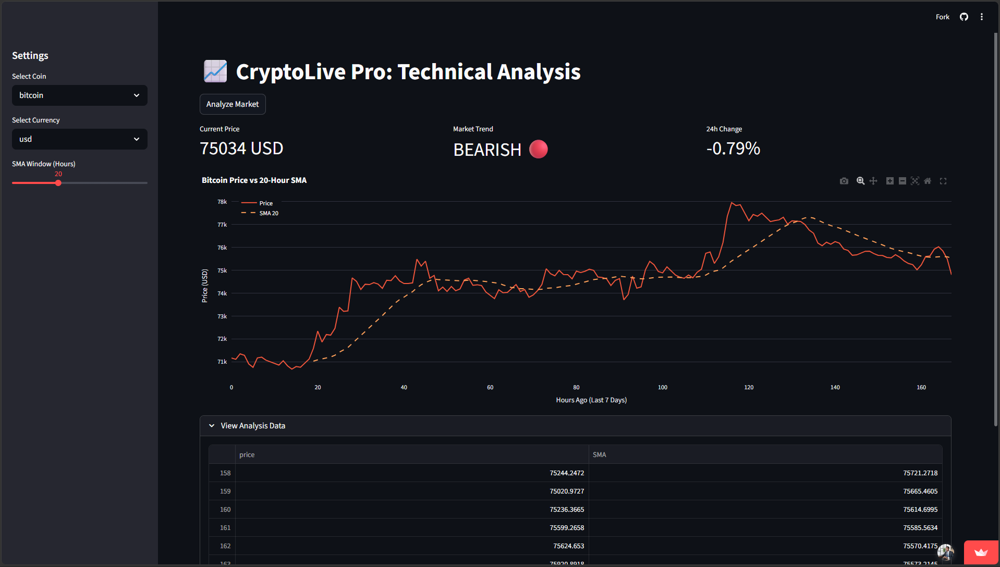

# 📈 CryptoLive Pro: Technical Analysis Dashboard

A lightweight, real-time cryptocurrency technical analysis dashboard built with Streamlit. Visualize price trends, compute moving averages, and assess market sentiment — all in your browser.
https://crypto-dashboard-by-tadaishe.streamlit.app/

---

## ✨ Features

- **Live Market Data** — Fetches real-time price and market data via the [CoinGecko API](https://www.coingecko.com/en/api)
- **Simple Moving Average (SMA)** — Configurable SMA window (5–50 hours) to smooth trend lines
- **Trend Detection** — Automatically classifies market sentiment as **Bullish 🟢** or **Bearish 🔴** based on price vs. SMA
- **Interactive Charts** — Candlestick-style price vs. SMA charts powered by Plotly (dark mode)
- **Multi-Currency Support** — View prices in USD, EUR, or GBP
- **Raw Data Inspection** — Expandable table showing the last 10 rows of computed analysis data

---

## 🖥️ Demo

> Select a coin → choose a currency → adjust your SMA window → click **Analyze Market**



---

## 🚀 Getting Started

### Prerequisites

- Python 3.8+
- pip

### Installation

1. **Clone the repository**

   ```bash
   git clone https://github.com/TadaisheChibondo/cryptolive-pro.git
   cd cryptolive-pro
   ```

2. **Create and activate a virtual environment** _(recommended)_

   ```bash
   python -m venv venv
   source venv/bin/activate        # macOS/Linux
   venv\Scripts\activate           # Windows
   ```

3. **Install dependencies**

   ```bash
   pip install -r requirements.txt
   ```

4. **Run the app**

   ```bash
   streamlit run app.py
   ```

   The dashboard will open at `http://localhost:8501`.

---

## 📦 Dependencies

| Package     | Purpose                             |
| ----------- | ----------------------------------- |
| `streamlit` | Web app framework                   |
| `requests`  | HTTP calls to CoinGecko API         |
| `pandas`    | Data manipulation & SMA calculation |
| `plotly`    | Interactive charting                |

Install all at once:

```bash
pip install streamlit requests pandas plotly
```

Or generate a `requirements.txt`:

```
streamlit>=1.32.0
requests>=2.31.0
pandas>=2.0.0
plotly>=5.18.0
```

---

## 🧠 How It Works

```
User selects coin + currency + SMA window
          │
          ▼
CoinGecko /coins/markets API (7-day sparkline, hourly)
          │
          ▼
pandas DataFrame → rolling().mean() → SMA column
          │
          ▼
Trend signal: Price > SMA → BULLISH, else BEARISH
          │
          ▼
Plotly chart: Price line + dashed SMA overlay
```

The SMA is computed using a rolling window over the hourly price history returned by CoinGecko's sparkline data (~168 data points for 7 days).

---

## ⚙️ Configuration

All settings are exposed in the **sidebar** — no code changes needed:

| Setting    | Options                           | Default  |
| ---------- | --------------------------------- | -------- |
| Coin       | Bitcoin, Ethereum, Solana, Ripple | Bitcoin  |
| Currency   | USD, EUR, GBP                     | USD      |
| SMA Window | 5 – 50 hours                      | 20 hours |

---

## 📁 Project Structure

```
cryptolive-pro/
├── app.py               # Main Streamlit application
├── requirements.txt     # Python dependencies
├── assets/
│   └── screenshot.png   # Dashboard preview image
└── README.md
```

---

## 🔮 Roadmap

- [ ] Add RSI (Relative Strength Index) indicator
- [ ] Support EMA (Exponential Moving Average) alongside SMA
- [ ] Multi-coin comparison view
- [ ] Price alert notifications
- [ ] Export chart as PNG / CSV download

---

## 🤝 Contributing

Contributions are welcome! Please open an issue first to discuss what you'd like to change, then submit a pull request.

1. Fork the repo
2. Create a feature branch (`git checkout -b feature/add-rsi`)
3. Commit your changes (`git commit -m 'Add RSI indicator'`)
4. Push to the branch (`git push origin feature/add-rsi`)
5. Open a Pull Request

---

## 📄 License

This project is licensed under the [MIT License](LICENSE).

---

## 🙏 Acknowledgements

- [CoinGecko](https://www.coingecko.com/) for providing a free, reliable crypto data API
- [Streamlit](https://streamlit.io/) for making data apps effortless to build
- [Plotly](https://plotly.com/) for beautiful interactive charts
